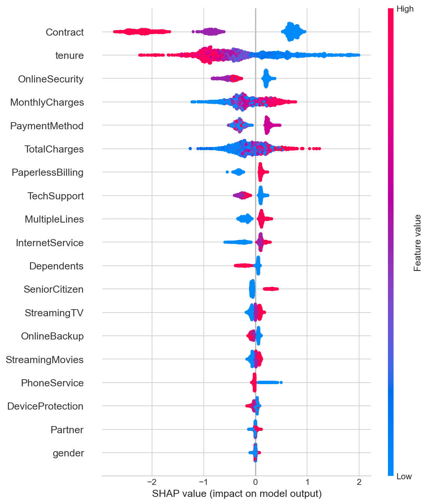
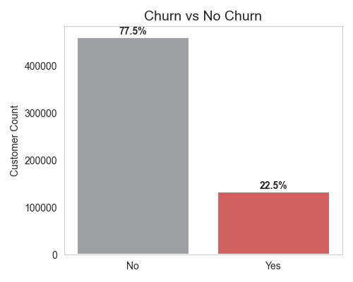
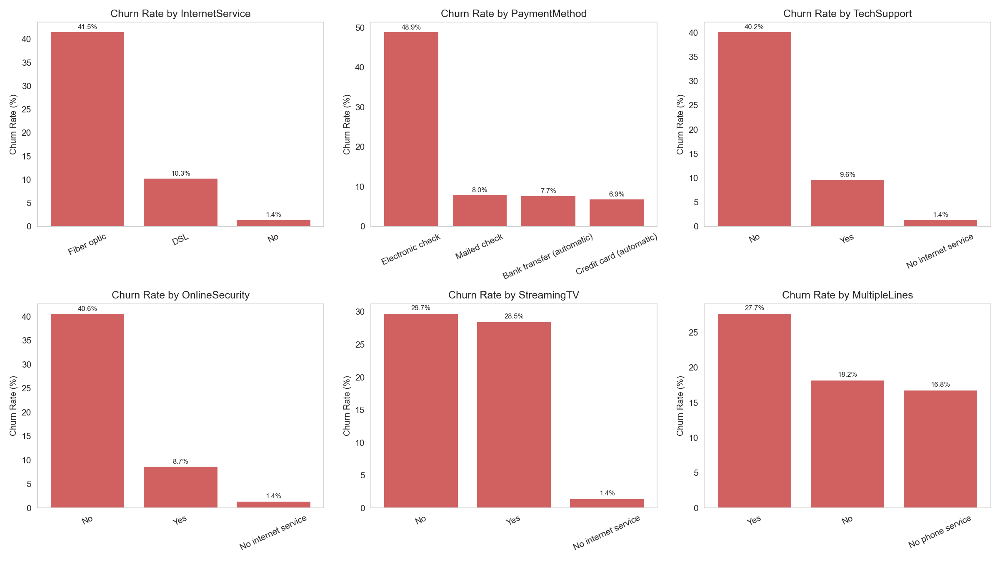
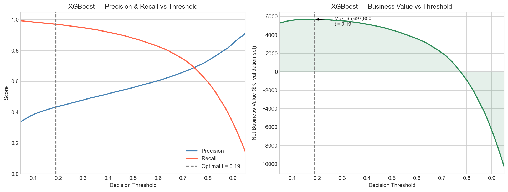
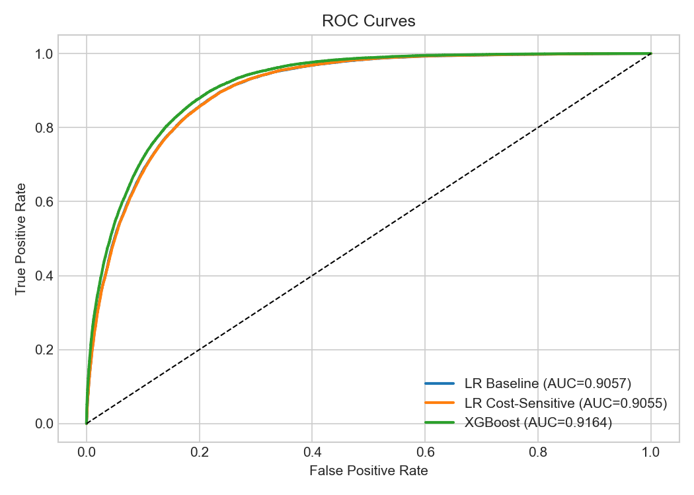

# Telco Customer Churn — End-to-End ML Product

An end-to-end machine-learning product for identifying at-risk telecom customers before they leave: from raw data exploration through to a deployed interactive prediction app. Built on the IBM Telco Customer Churn dataset (sourced via Kaggle PS S6E3, ~594K synthetic training rows).

> **Customer acquisition costs 5–25× more than retention.** This project quantifies exactly what each customer is worth to flag — and what it costs to miss them.

## Live Demo

[](https://telco-customer-churn-end-to-end-ml.streamlit.app/)

*After cloning and training the model locally, deploy to [Streamlit Community Cloud](https://streamlit.io/cloud) for free — see [Quick Start](#quick-start) below.*

---

## Key Results

| Model | CV ROC-AUC | Net value / 10,000 customers | vs. Baseline |
|---|---|---|---|
| Logistic Regression (baseline) | 0.9051 | +$14,600 | — |
| Logistic Regression (cost-sensitive) | 0.9049 | +$374,000 | **+$360,000** |
| **XGBoost** | **0.9161** | **+$381,000** | **+$367,000** |

> Dollar values: missed churner = **$500** (lost CLV), wasted offer = **$50**, successful retention = **$300**. Adjustable in `src/model_utils.py`.

**Threshold optimisation** (t = 0.28) lifts XGBoost net value by a further **+23%** — with zero model change.

The cost-sensitive logistic regression, despite nearly identical AUC to the baseline (0.9049 vs 0.9051), delivers **25× more business value** at the default threshold. ROC-AUC is a misleading guide for deployment decisions.

---

## Model Explainability (SHAP)

SHAP values expose *why* a customer is flagged — making predictions auditable for business stakeholders.



The dominant risk drivers are **Contract type**, **tenure**, and **MonthlyCharges** — consistent with domain intuition: month-to-month customers who have been around long enough to shop alternatives, and are paying more than the service feels worth, form the highest-risk cohort.

---

## EDA Highlights

| Churn distribution | Churn rate by category |
|---|---|
|  |  |

22.5% base churn rate. Month-to-month contract holders and Fiber optic subscribers churn at 2–3× the rate of long-term contract customers.

---

## Threshold Optimisation



The left panel shows the precision/recall tradeoff as the decision threshold moves. The right panel converts this directly into net business value — the optimal threshold (t = 0.28) maximises dollar return, not the F1 score.

---

## ROC Curves



---

## Project Structure

```
├── data/
│   ├── raw/                  # CSVs — not committed (generate locally or download from Kaggle)
│   └── processed/            # EDA figures (committed), submission.csv
├── notebooks/
│   ├── 01_eda.ipynb          # Exploratory analysis & business insights
│   ├── 02_modeling.ipynb     # Pipeline, 3 models, cost analysis, SHAP, submission
│   └── 03_predict_ibm.ipynb  # Apply best model to original IBM dataset (in progress)
├── src/
│   ├── preprocessing.py      # Feature lists, pipeline builder — single source of truth
│   ├── model_utils.py        # evaluate(), cost table, threshold analysis, SHAP helpers
│   └── models/               # Saved .pkl pipelines — not committed
├── app/
│   └── app.py                # Streamlit prediction app
├── requirements.txt
└── README.md
```

---

## Quick Start

```bash
# 1. Install dependencies
pip install -r requirements.txt

# 2. Add raw data to data/raw/
#    train.csv, test.csv  →  from https://www.kaggle.com/competitions/playground-series-s6e3

# 3. Run EDA
jupyter nbconvert --to notebook --execute notebooks/01_eda.ipynb --output notebooks/01_eda.ipynb

# 4. Train models, generate submission, save .pkl
jupyter nbconvert --to notebook --execute notebooks/02_modeling.ipynb --output notebooks/02_modeling.ipynb

# 5. Launch the Streamlit app
streamlit run app/app.py
```

**Deploy to Streamlit Community Cloud** (free):
1. Push your repo to GitHub
2. Go to [streamlit.io/cloud](https://streamlit.io/cloud) → New app → point at `app/app.py`
3. The model `.pkl` must be committed or loaded from a URL (see note in `app/app.py`)

---

## Data

Sourced from [Kaggle Playground Series S6E3](https://www.kaggle.com/competitions/playground-series-s6e3/overview), which was synthetically generated from the [IBM Telco Customer Churn dataset](https://github.com/IBM/telco-customer-churn-on-icp4d/blob/master/data/Telco-Customer-Churn.csv).

- **Train**: 594,194 rows | **Test**: 254,655 rows | **Features**: 20
- **Target**: `Churn` (Yes/No → 1/0) | **Base rate**: 22.5%

The final model is validated against the original ~7K IBM dataset in `03_predict_ibm.ipynb`.

---

## What I Learned

I started with logistic regression because interpretability matters for stakeholder buy-in — a model a product manager can't explain won't get approved. The baseline (AUC 0.905) was surprisingly strong, which reflects the well-structured nature of the dataset.

The most useful insight came not from the model selection step, but from the cost analysis: the cost-sensitive logistic regression, despite nearly identical AUC, delivers **25× more business value** at a 0.5 threshold. This happens because `class_weight='balanced'` shifts the model's operating point toward higher recall — it catches far more churners at the cost of more false alarms, and since the asymmetry between missed churner ($500) and wasted offer ($50) is 10:1, that trade is profitable. ROC-AUC, which is threshold-agnostic, completely misses this.

Threshold optimisation then added a further 23% uplift on top of that with no model change — reinforcing that the decision threshold is a business parameter, not a modelling parameter.

Adding SHAP explainability also surfaced something useful: `TotalCharges` was acting partly as a proxy for `tenure` (since total charges ≈ monthly charges × tenure for well-behaved accounts). This raised the question of whether both features carry independent signal, which is worth investigating in future feature engineering.

I chose XGBoost as the final model because it captures non-linear feature interactions that logistic regression misses — high monthly charges *combined with* a month-to-month contract is more predictive of churn than either feature in isolation — while still being fast enough to re-train on the full 594K dataset in a reasonable time.
